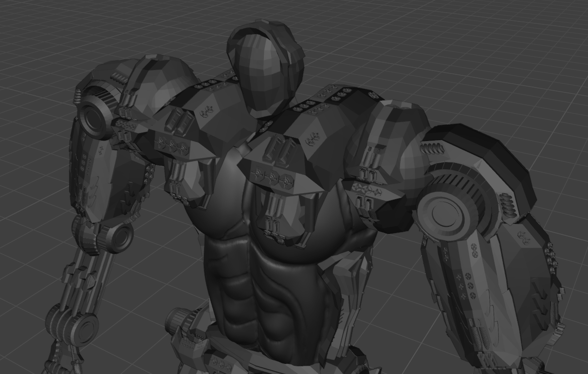
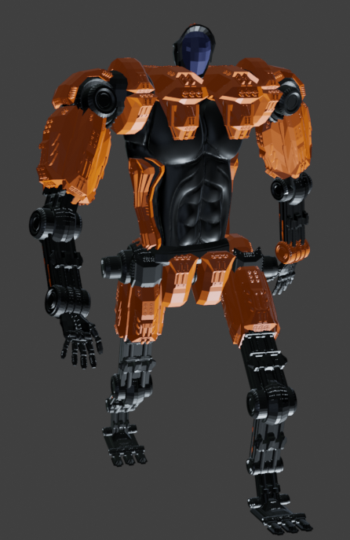
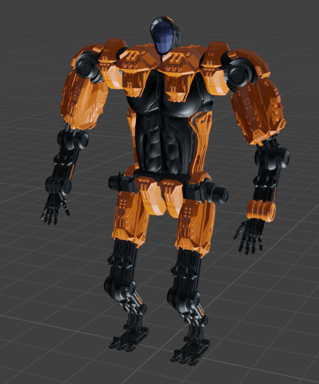
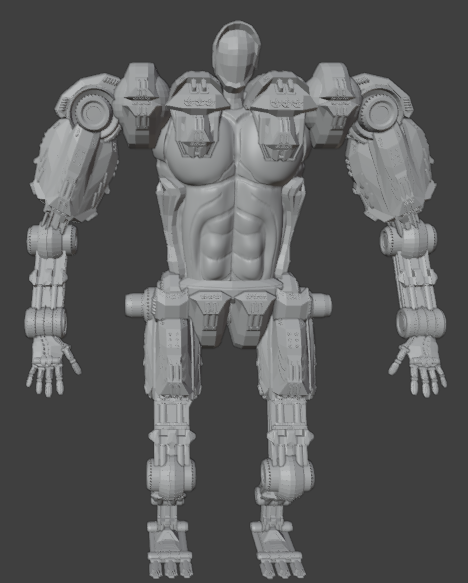
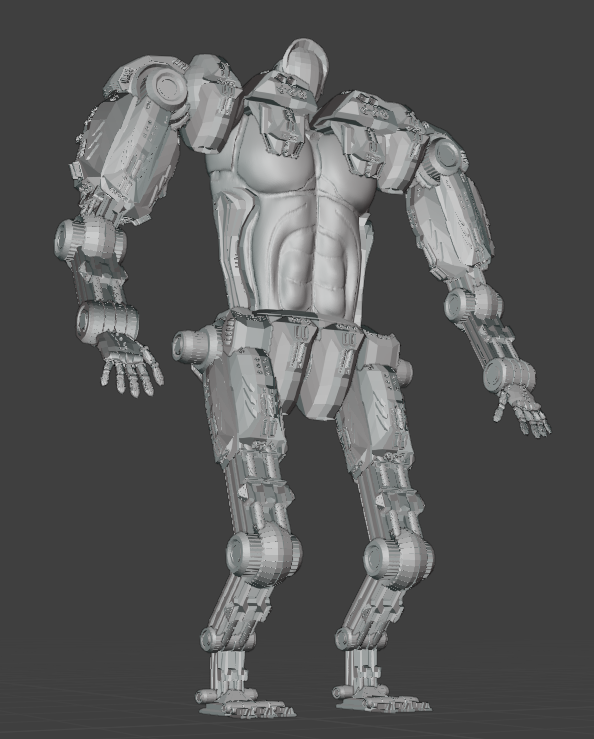
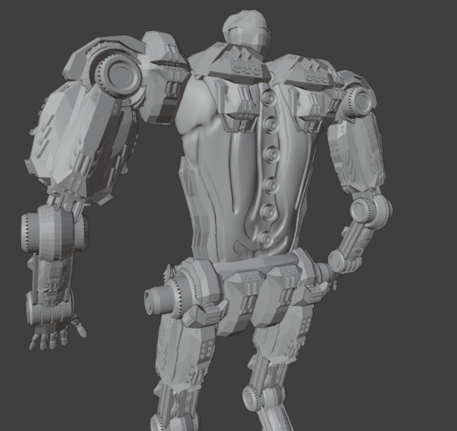
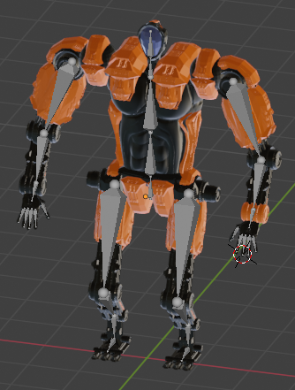
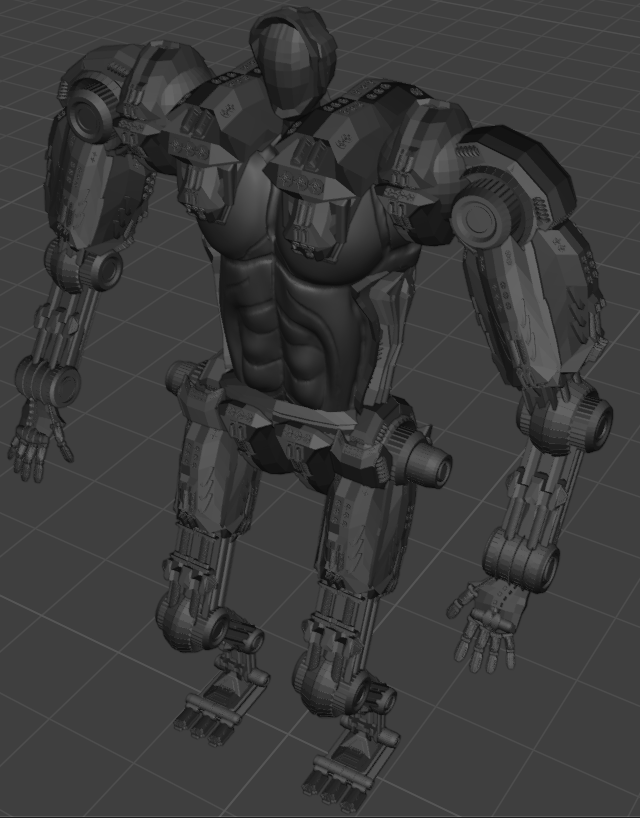

# 🤖 It is a Robot!
Welcome to my very first 3D project in **Blender** – and yes, *It is a Robot!*  

This mechanical buddy was built from scratch and is ready to show off its style, structure, and sweet dance moves.

  

---

## 🛠️ It is a Robot – A cool journey!

Creating this robot was my introduction to Blender. I worked on this project as part of a university course at 
**Aalen University**, where I was studying. Here's how the journey went:

### 🧩 Building the Bot
From basic shapes to detailed geometry – and of course, making a bit of a mess along the way was just part of the fun.

- I started with **low poly modeling**
- Created a lot of small components for **detailing**
- Went to a much more **high poly design**
- **Sculpted** for the **smooth design** of the chest
- Had a lot of fun and learned a *ton* along the way!

🎥 Showcase:

---

### 🎨 Texturing & Shading

Using Blender’s Shader Editor, I aimed for a clean and colorful look.
I also experimented *a lot* with lighting and reflections to bring this robot to life.

📸 Eventually I ended up with something like this:

---

## 🎬 It is a Robot – With Animations!

And then... it moved!  
Rigging the robot with bones and controllers opened up the next level.
Now this beast is on the way - you better don't stop it!

Using the rig, I created **three key animations**:

- **Running** – on the way 🏃
- **Idle** – just chilling, waiting for some input 💤
- **Dancing** – because why not? 🕺

|        |  |         |
|------------------------------------------------------------|-------------------------------------------------------------|------------------------------------------------------------|
|      |          |  |
|  |        |        |

- **Running** – on the way 🏃

   The running animation was my first animation I created with the rig. It was actually quite the challenge! The result looks quite humanoid.
  

- **Idle** – just chilling, waiting for some input 💤

  Here I was able to really live out my creative side again. The animation actually consists of a series of chained, independent sub-animations.
  
- **Dancing** – because why not? 🕺

   If you encounter me in the disco, this is actually quite close to how you would see me dancing.
  

### 🎬 What a journey!

I had a great time doing that beast!
Yes, I spent waaay too many nights on it – but I’m super proud of the result.
I really enjoyed learning to **model**, **texture**, **rig** and **animate** 3d models! 
This was the first time I was using Blender, and I am already dreaming of more bots.

---

## 📜 License

This project is licensed under the [MIT License](LICENSE).
Feel free to use or remix it – just give proper credit. 🤝

---

## Gallery

🎬 [Watch black robo showcase (MKV)](media/video/Robo_Showcase_Black.mkv)

🎬 [Watch white robo showcase (MKV)](media/video/Robo_Showcase_White.mkv)

  
  
  
  
  
  

