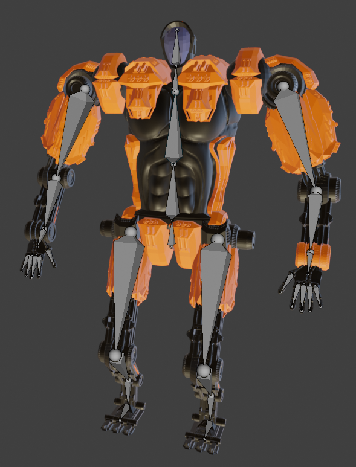

# 🤖 It is a Robot!
Welcome to my very first 3D project in **Blender** – and yes, *It is a Robot!*  

This mechanical buddy was built from scratch and is ready to show off its style, structure, and sweet dance moves.

---

## 🛠️ It is a Robot – A cool journey!

Creating this robot was my introduction to Blender. I did this project as part of a lecture at Aalen University
where I was studying. Here's how the process went:

### 🧩 Building the Bot
From basic shapes to detailed geometry - and of course, creating a little bit of mess on the way is just part of it.

- I started with **low poly modeling**
- Created a lot of small components for detailing
- Went to a much more **high poly design**
- Sculpted the body for the **high poly finish**
- Had a lot of fun and learned a ton along the way!

🎥 Showcase:

---

### 🎨 Texturing & Shading

Using Blender's Shader Editor, I tried creating a clean and colorful look.
I also played a lot with lighting and reflections.

📸 Eventually I ended up with something like this:

---

## 🎬 It is a Robot – With Animations!

And then... it moved!  
Rigging the robot with bones and controllers opened up the next level.
Now this beast is on the way - you better dont stop it!

Using the rig, I created **three key animations**:

- **Running** – on the way
- **Idle** – just chilling, waiting for some input
- **Dancing** – because why not?

|        |  |         |
|------------------------------------------------------------|-------------------------------------------------------------|------------------------------------------------------------|
|      |          |  |
|  |        |        |

- **Running** – on the way 🏃

   The running animation was my first animation I created with the rig. It was actually quite the challenge! The result looks quite humanoid.
  

- **Idle** – just chilling, waiting for some input 💤

  Here I was able to really live out my creative side again. The animation actually consists of a series of chained, independent sub-animations.
  
- **Dancing** – because why not? 🕺

   If you encounter me in the disco, this is actually quite close to how you would see me dancing
  

## 🎬 What a journey!

I had a great time doing that beast! And of course I spent waaay to many nights on it, but the results are really cool!
I really enjoyed learning to model, texture, rig and animate 3d models! This was the first time i was using Blender, and i am already dreaming of more bots.

---

## 📜 License

This project is licensed under the [MIT License](LICENSE).
Feel free to use or remix it – just give proper credit. 🤝

---

## Gallery

🎬 [Watch black robo showcase (MKV)](media/video/Robo_Showcase_Black.mkv)

🎬 [Watch white robo showcase (MKV)](media/video/Robo_Showcase_White.mkv)

|  |
|------------------------------------------------------------------|
|               |
|                 |
|             |
|   |
|          |